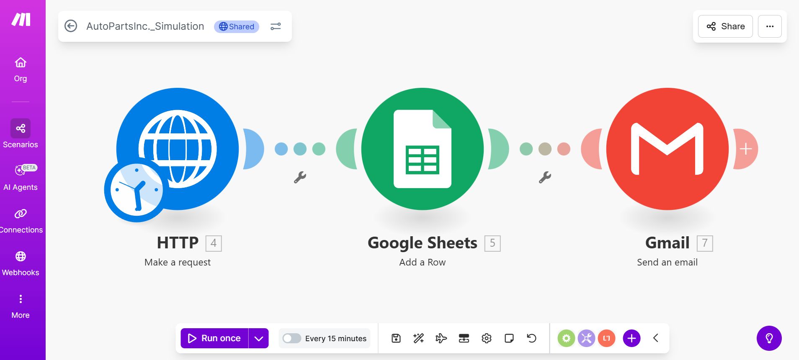

## Simulation Workflow – AutoParts Inc.

This scenario was built on Make.com to simulate AI Agent implementation for smart manufacturing.

- **Scenario Name:** AutoPartsInc_SmartManufacturing_AI_Agents
- **Modules Used:** Schedule → HTTP (OpenAI) → Google Sheets → Email
- **Purpose:** Quality Control Agent simulation with defect detection and reporting.

👉 [View the Scenario on Make.com](https://eu1.make.com/public/shared-scenario/5SQKXxnkacS/auto-parts-inc-simulation)

(Optional)  
